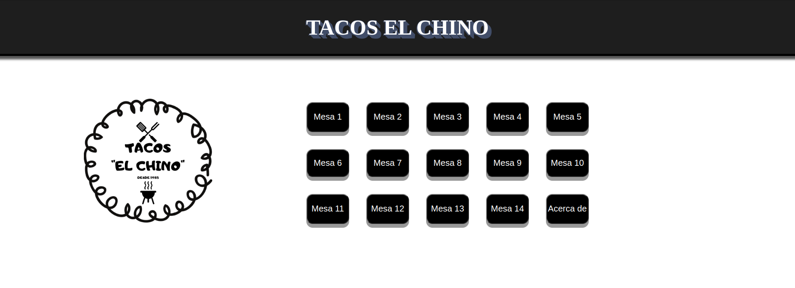

# Sales System for ticket breakdown

## Title

# Ticket Breakdown

## Table of contents.

```
└── 📁tacos1.0-project
    └── 📁img
        └── interface.png
        └── logotaqueria.jpg
        └── perfil.jpg
        └── perfil2.jpg
    └── .prettierrc
    └── app.js
    └── index.css
    └── index.html
    └── README.md
```

# Description.

In this project, the purpose is to do a ticket breakdown of each table

# How to Install and Run the Project.

In your terminal will run:

```bash
git clone https://github.com/BrightCoders-Institute/s1a2-introducci-n-a-ruby-angel23v.git
```

To run the project in your terminal go to the path project run "code ." & copy the html path and paste it in your browser

# How to Use the Project.

To use the project just open the html in your browser

# Credits

Co-Author: DevLuis123 <lgutierrez23@ucol.mx>

# Badges


